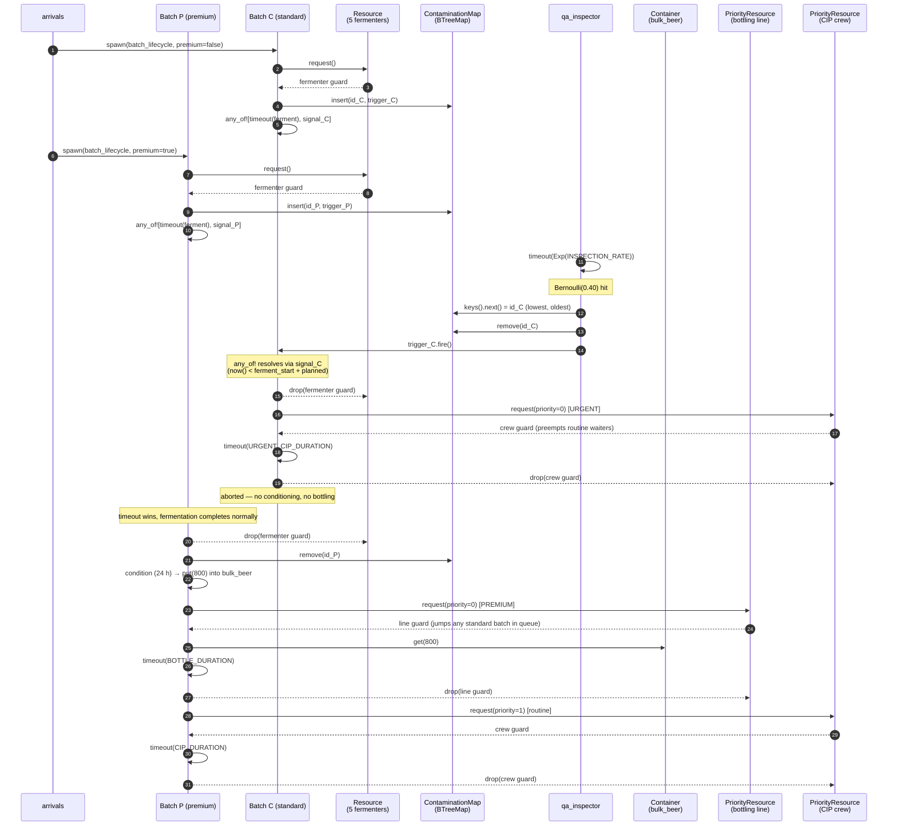

# Brewery Simulation — Example Walkthrough

## The Beer Brewing Process

Beer is produced by fermenting a sugar-rich liquid (wort) extracted from malted grain, then
conditioning and packaging the resulting beverage. The process has been practised for millennia
but its industrial form maps cleanly onto a discrete-event pipeline with capacity constraints
at every stage.

### Stage 1 — Mashing

Milled malted barley is mixed with hot water (60–75 °C) in a **mash tun** and held for
60–90 minutes. Naturally occurring enzymes break down the grain's starches into fermentable
sugars, producing a sweet liquid called *wort*. Temperature control is critical: too low and
conversion is incomplete; too high and the enzymes are deactivated. The spent grain solids are
then separated from the liquid in a process called *lautering*.

### Stage 2 — Boiling

The wort is transferred to a **brew kettle** and brought to a rolling boil for 60–90 minutes.
Hops are added at timed intervals — early additions contribute bitterness (alpha-acid
isomerisation), later additions contribute aroma. Boiling also sterilises the wort, drives off
unwanted volatile compounds (notably dimethyl sulphide), and causes proteins to coagulate and
precipitate. The boil drives off significant amounts of **CO₂**, which can be captured and used
later for carbonation. After boiling the wort is rapidly cooled (typically via a plate heat
exchanger) before yeast is added.

### Stage 3 — Fermentation (the bio-reactor)

Cooled wort is transferred to a **fermenter** — a sealed stainless-steel vessel — and a measured
quantity of yeast slurry is *pitched* (inoculated). For ales (top-fermenting strains) fermentation
runs at 18–22 °C for 4–7 days; for lagers (bottom-fermenting strains) it runs at 8–14 °C for
1–3 weeks. The yeast consumes the fermentable sugars, producing ethanol and CO₂ as primary
by-products along with hundreds of flavour compounds. Fermentation is monitored continuously —
off-odours, abnormal temperature rises, or unexpected gravity readings can indicate microbial
contamination, in which case the batch must be aborted and the vessel decontaminated.

### Stage 4 — Conditioning (maturation)

After primary fermentation the green beer is transferred to a **conditioning tank** and held at
near-freezing temperatures (−1 to 4 °C) for days to several weeks. Residual yeast and proteins
precipitate, harsh flavour compounds mellow, and carbonation equilibrates. This stage is
responsible for much of a beer's final character and clarity.

### Stage 5 — Filtration & Bottling

Conditioned beer is optionally filtered (kieselguhr / sheet filtration) and then transferred via
a **bottling** or kegging line. Counterpressure filling prevents CO₂ loss and oxidation. Packages
are sealed, labelled, pasteurised (in some styles), and palletised for distribution.

### Stage 6 — CIP (Clean-in-Place)

Every vessel and transfer line must be thoroughly cleaned between batches using a **CIP system**:
an automated sequence of caustic rinse, water flush, acid rinse, and final sterilisation with
either hot water or steam. A standard CIP cycle takes 45–90 minutes; a contamination event
triggers an extended cycle (2–3 hours) with stronger chemicals and an additional inspection step.
CIP capacity is a genuine bottleneck in high-throughput breweries.

---

### Further reading

<!-- TODO: replace these placeholders with your preferred sources -->
- [_URL 1_]() — Overview of the brewing process (e.g. a homebrewing association or brewing school)
- [_URL 2_]() — Fermentation science and bio-reactor design in brewing
- [_URL 3_]() — Craft brewery operations and process automation

---

`examples/brewery.rs` is a Monte Carlo craft-brewery simulation set in the
**food & beverage / process automation** domain. It models a multi-stage
production line whose central bio-reactor (the fermenter) is the system's
natural bottleneck.

It exercises every public primitive of `simu` in a single scenario:

| Feature              | How it is used                                                                       |
|----------------------|--------------------------------------------------------------------------------------|
| `Resource`           | Mash tuns, kettles, fermenters, conditioning tanks (capacity-limited equipment)      |
| `PriorityResource`   | Bottling line (premium > standard) and CIP crew (urgent > routine)                   |
| `Container`          | Hot-water buffer, yeast slurry, CO₂ recovery, bulk-beer storage                      |
| `EventTrigger`       | Per-batch contamination signal                                                       |
| `any_of!`            | Fermentation timer races against the contamination signal                            |
| `ProcessHandle` + `AllOf` | `arrivals` collects every batch's handle; `AllOf` joins them at end-of-week     |
| `monte_carlo::run`   | Ten seeds execute in parallel on separate OS threads                                 |

Run it:

```bash
cargo run --example brewery --release
```

Each seed writes a full event log to `brewery_run_00.log` … `brewery_run_09.log`;
the summary table prints to stdout.

---

## Configuration

```rust
const SIM_DURATION:   f64 = 168.0;      // one week, in hours
const ARRIVAL_RATE:   f64 = 1.0 / 12.0; // Poisson, ~1 batch every 12 h
const PREMIUM_PROB:   f64 = 0.25;       // 25 % of orders are premium

const MASH_DURATION:      f64 =  2.0;
const BOIL_DURATION:      f64 =  1.5;
const FERMENT_MEAN:       f64 = 60.0;   // ~2.5 days, Normal(60, 6)
const CONDITION_DURATION: f64 = 12.0;
const BOTTLE_DURATION:    f64 =  6.0;
const CIP_DURATION:       f64 =  1.0;
const URGENT_CIP_DURATION:f64 =  2.5;

const INSPECTION_RATE:    f64 = 1.0 / 30.0;  // QA inspection every ~30 h
const CONTAMINATION_PROB: f64 = 0.40;        // P(found | inspected)
```

Equipment per run:

| Resource              | Type                          | Capacity |
|-----------------------|-------------------------------|----------|
| Mash tuns             | `Resource`                    | 2        |
| Kettles               | `Resource`                    | 2        |
| **Fermenters (bio-reactors)** | `Resource`            | **5** *(the bottleneck)* |
| Conditioning tanks    | `Resource`                    | 4        |
| Bottling line         | `PriorityResource`            | 1        |
| CIP crew              | `PriorityResource`            | 1        |

Continuous resources (all `Container`):

| Buffer        | Capacity | Initial | Per-batch flow                     | Replenishment             |
|---------------|---------:|--------:|------------------------------------|---------------------------|
| Hot water     |    2 000 |   1 500 | `get(500)` per mash                | `put(400)` every 4 h      |
| Yeast slurry  |      100 |      30 | `get(5)` per fermentation start    | `put(8)` every 24 h *(tight)* |
| CO₂ recovery  |   10 000 |       0 | `put(40)` per boil                 | n/a (uncapped sink)       |
| Bulk beer     |    5 000 |       0 | `put(800)` from conditioning, `get(800)` at bottling | n/a |

The yeast supply is intentionally tight — over a long week, the buffer
gradually depletes and a few late batches end up suspended in the FIFO
get-queue until the next propagation cycle.

---

## Processes

| Process                    | Count       | Responsibility                                            |
|----------------------------|-------------|-----------------------------------------------------------|
| `arrivals`                 | 1 (spawner) | Generates batches at Poisson inter-arrivals, joins them at end-of-week |
| `hot_water_replenishment`  | 1           | `Container::put(400)` every 4 h                           |
| `yeast_propagation`        | 1           | `Container::put(8)` every 24 h                            |
| `qa_inspector`             | 1           | At Poisson ticks, contaminates the oldest fermentation with P=0.40 |
| `batch_lifecycle`          | N (one per arrival) | mash → boil → ferment → (condition → bottle) → CIP |

---

## Per-batch lifecycle

```
                                     ┌──── contamination_signal ────┐
                                     │                              ▼
mash ──► boil ──► (yeast.get) ──► fermenter ──┬──► condition ──► bottle ──► routine CIP
                                              └────────────► urgent CIP (priority 0)
```

Every batch acquires equipment in order, releasing each guard before
requesting the next. The fermentation step is the only one that can
short-circuit: the `any_of!` between the natural timer and the personal
contamination signal decides whether the batch proceeds to conditioning or
is aborted.

Contaminated batches **skip conditioning and bottling entirely** and head
straight to CIP with priority 0, preempting any routine cleanups behind
them.

---

## Contamination flow — message sequence chart

The diagram below traces a normal premium batch and a contaminated
standard batch through the system. Batch C is mid-fermentation when the
QA inspector picks it (lowest id in the `ContaminationMap`) and fires its
trigger.



### Reading the diagram

1. **Both batches** register their personal contamination triggers in a
   `BTreeMap<u32, EventTrigger>` keyed by batch id when they enter
   fermentation. Because `BTreeMap::keys().next()` always yields the
   smallest key, the QA inspector's "pick the oldest" rule is one line of
   code.

2. **Why a per-batch trigger, not a global one?** `EventAwaitable` latches
   permanently once fired — every clone returns `Ready` forever after. A
   single global contamination event would cause every subsequent batch's
   `any_of!` to resolve instantly. One trigger per batch keeps the signal
   targeted, exactly mirroring the per-patient eviction trigger in
   `examples/hospital.rs`.

3. **Detecting which `any_of!` branch fired**: the combinator returns
   `()`, so the batch infers contamination by comparing `env.now()` to
   the planned deadline:

   ```rust
   let was_contaminated = env.now() < ferment_start + ferment_duration;
   ```

4. **Priority preemption**: when Batch C requests the CIP crew with
   priority 0 it jumps ahead of any routine (priority 1) cleanups already
   queued. Premium bottling works the same way — premium batches are
   priority 0, standard are priority 1.

---

## Joining all batches with `AllOf`

`arrivals` keeps every spawned `ProcessHandle<()>` and, after the order
book closes, joins all of them so the harness can record the simulated
time the production line is fully drained:

```rust
let mut batch_futs: Vec<Pin<Box<dyn Future<Output = ()>>>> = Vec::new();

loop {
    // ... Poisson tick, premium roll, env.spawn(batch_lifecycle(...)) ...
    let handle = env.spawn(batch_lifecycle(env.clone(), batch_id, premium, ctx.clone()));
    batch_futs.push(Box::pin(handle.discard()));
}

// After SIM_DURATION: wait for every batch to finish CIP.
let all_batches = AllOf::new(batch_futs);
any_of![all_batches, env.timeout(SIM_DURATION * 10.0)].await;
ctx.stats.borrow_mut().line_cleared_at = env.now();
```

`ProcessHandle<()>::discard()` returns a `Future<Output = ()>` so it can
be boxed and dropped into `AllOf::new(Vec<Pin<Box<dyn Future>>>)`. The
hard-deadline `timeout` is a safety net in case a stuck batch would
otherwise keep the simulation alive forever (e.g. yeast pool exhausted
after propagation has shut down).

---

## Sample output

```
Seed  Arrivals  Premium  Standard  Cont.    Litres   Yeast   Ferment(h)   Bottling(h)     Yeast(h)    Cleared
----------------------------------------------------------------------------------------------------------------
   0        14        2         9      3      8800       0          1.1           0.5         0.00      251.5
   1        15        2        12      1     11200       0          9.2           1.5         0.00      267.0
   2        16        3        10      3     10400       1         11.1           0.9         0.28      260.5
   ...
mean      14.0      2.6       9.5    1.9      9680     0.1          4.3           1.0         0.03      255.4
```

- **Arrivals**: Poisson-distributed orders accepted in the week.
- **Premium / Standard**: completed batches per class (excluding contaminated).
- **Cont.**: batches lost to contamination — they consumed equipment time
  and yeast but produced no beer.
- **Litres**: total beer bottled (`completed × 800 L`).
- **Yeast**: number of batches whose `yeast.get(5)` had to suspend.
- **Ferment(h)** / **Bottling(h)** / **Yeast(h)**: mean wait times in
  hours per batch on those resources. The fermenter wait shows the
  bio-reactor saturating — at ~93% utilisation the queue grows and
  shrinks across the week.
- **Cleared**: simulated time at which the very last batch finished its
  CIP. Always > `SIM_DURATION` because batches that arrived late still
  need ferment + condition + bottle + CIP after the order book closes.

---

## Key design patterns reused from `hospital.rs`

- **`BTreeMap<u32, EventTrigger>` for "pick the oldest"** — used here for
  contamination, used in hospital for eviction. Same one-liner:
  `map.keys().next().copied()`.
- **`any_of!` branch detection by clock comparison** — both examples
  infer which branch fired by checking `env.now()` against the planned
  deadline.
- **Shared context struct (`BreweryCtx`) cloned into every spawned
  process** — `Resource` / `PriorityResource` / `Container` are all
  cheaply `Clone`able (internal `Rc<RefCell<…>>`), so cloning the whole
  context is fine on a single-threaded `SimEnv`.
- **`Rc<RefCell<Vec<String>>>` log + uniform `[t={:6.1}] …` format** — no
  mutex needed because everything runs on one thread.
- **Sample RNG before any `.await`** — `env.rng()` returns a guard that
  cannot be held across await points; the compiler enforces this via
  `!Send`.

---

## Files referenced

- **`examples/brewery.rs`** — the simulation source
- **`examples/hospital.rs`** — sister example in the medical domain
- **`src/resource/mod.rs`** — `Resource` / `ResourceGuard`
- **`src/resource/priority.rs`** — `PriorityResource`
- **`src/resource/container.rs`** — `Container` with FIFO put/get cascades
- **`src/combinator.rs`** — `AnyOf` / `AllOf` + `any_of!` / `all_of!` macros
- **`src/event.rs`** — `EventTrigger` / `EventAwaitable`
- **`src/process.rs`** — `ProcessHandle<T>` and `discard()`
- **`src/monte_carlo.rs`** — `monte_carlo::run`
