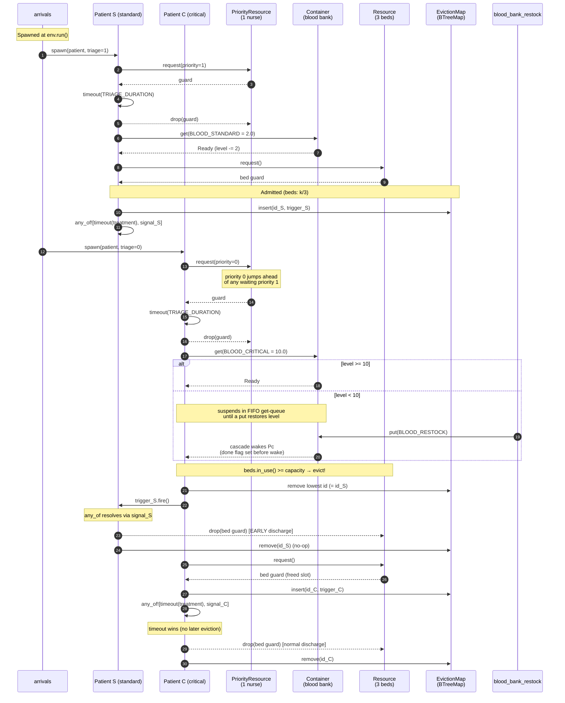
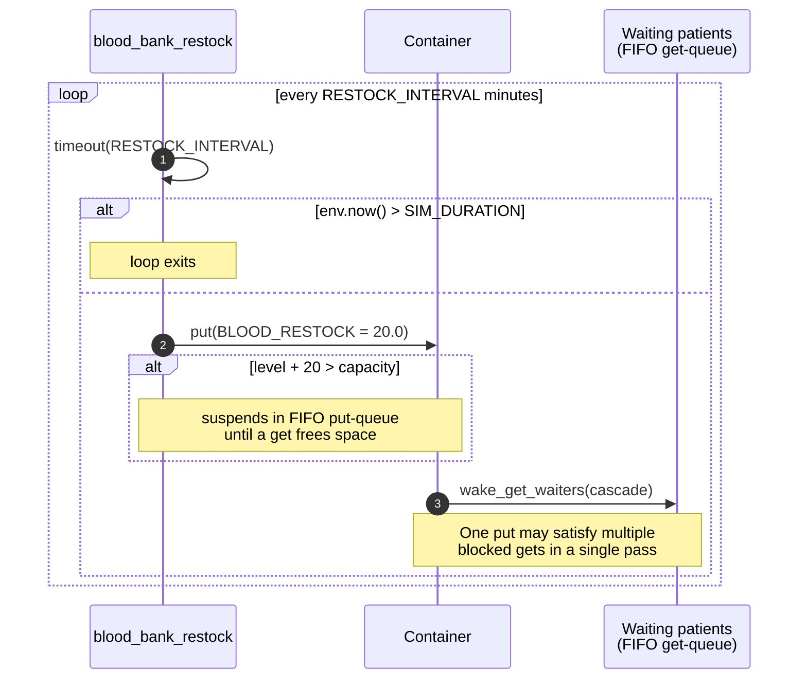

# Hospital Simulation — Example Walkthrough

`examples/hospital.rs` is a Monte Carlo hospital-emergency-department simulation
that exercises every post-MVP feature of `simcore` in a single, realistic scenario:

| Feature              | How it is used                                                   |
|----------------------|------------------------------------------------------------------|
| `PriorityResource`   | Triage nurse serves critical patients (priority 0) ahead of standard (priority 1) |
| `Resource`           | Three beds compete on a FIFO queue                               |
| `Container`          | Blood bank with `f64` level; restocked periodically              |
| `EventTrigger`       | Per-patient eviction signal                                      |
| `any_of!`            | Treatment races against the eviction signal                      |
| `monte_carlo::run`   | Ten seeds execute in parallel on separate OS threads             |

Run it:

```bash
cargo run --example hospital
```

Each seed writes a full event log to `target/sim-logs/run_00.log` …
`target/sim-logs/run_09.log`; the summary table prints to stdout.

---

## Configuration

```rust
const SIM_DURATION:     f64 = 480.0;    // 8-hour shift (minutes)
const ARRIVAL_RATE:     f64 = 1.0 / 8.0; // Poisson, ~8 min between arrivals
const TRIAGE_DURATION:  f64 = 5.0;      // nurse takes 5 min per patient
const MEAN_TREATMENT:   f64 = 20.0;     // Exp(1/20) treatment time
const CRITICAL_PROB:    f64 = 0.3;      // 30 % critical, 70 % standard

const BLOOD_CAPACITY:   f64 = 100.0;
const BLOOD_INITIAL:    f64 = 60.0;
const BLOOD_RESTOCK:    f64 = 20.0;
const RESTOCK_INTERVAL: f64 = 60.0;
const BLOOD_CRITICAL:   f64 = 10.0;    // critical patient drain
const BLOOD_STANDARD:   f64 =  2.0;    // standard patient drain
```

Resources per run:
- **1** triage nurse (`PriorityResource::new(1)`)
- **3** beds (`Resource::new(3)`)
- **1** blood bank, 100-unit capacity, starts at 60 (`Container::new(100.0, 60.0)`)

---

## Processes

Three kinds of async processes run inside each `SimEnv`:

| Process             | Count       | Responsibility                                  |
|---------------------|-------------|-------------------------------------------------|
| `arrivals`          | 1 (spawner) | Generates patients at Poisson inter-arrivals    |
| `blood_bank_restock`| 1           | Adds `BLOOD_RESTOCK` units every `RESTOCK_INTERVAL` |
| `patient`           | N (one per arrival) | Full triage → blood → bed → treatment lifecycle |

---

## Patient lifecycle — message sequence chart

The diagram below traces one standard and one critical patient through the
system. The critical patient arrives while all beds are occupied, so they
trigger an **early discharge** of the longest-admitted standard patient.



### Reading the diagram

1. **Patient S** arrives first (standard, triage = 1), passes triage, draws 2 units of blood, gets a bed, and registers its personal `EventTrigger` (`trigger_S`) in the eviction map before starting the `any_of!` race between `timeout(treatment)` and `signal_S`.

2. **Patient C** arrives later (critical, triage = 0) and **jumps the nurse queue** (priority 0 beats priority 1). The blood draw may block — when the bank's level is insufficient, the critical patient suspends in the container's FIFO get-queue until a `put` (either another `get` freeing space or the `restock` process) makes enough available. The cascade commits the level change *before* waking, so Patient C sees the correct level immediately.

3. **Eviction path**: before requesting a bed, the critical patient checks `beds.in_use() >= beds.capacity()`. If so, they pop the lowest-id entry from `EvictionMap` (the longest-admitted patient) and fire that patient's personal trigger. Patient S's `any_of!` resolves via the signal branch, their bed guard drops, and a slot opens up for Patient C.

4. **Cleanup**: each patient removes their own entry from the eviction map after `any_of!` resolves. This is a no-op if they were already evicted.

---

## Blood bank restock — independent cycle

The `blood_bank_restock` process runs concurrently with patient flow:



`put` blocks if the bank is already full (SimPy semantics) — the restock process
waits until enough patients have drawn blood to make room. When the `put`
succeeds, the cascade greedily serves as many queued `get`s as the new level
allows, so a single restock can unblock multiple patients simultaneously.

---

## Key design patterns

### Per-patient eviction trigger (not a global broadcast)

`EventAwaitable` latches permanently once fired — every future clone sees
`fired == true` and resolves immediately. Using a **single** global eviction
event would cause *all subsequent patients* to resolve their `any_of!` at the
admission instant, incorrectly marking everyone as early-discharged.

The fix is one `EventTrigger` per admitted patient, stored in a
`BTreeMap<u32, EventTrigger>`. `BTreeMap` guarantees ascending key iteration,
so `.keys().next()` always yields the longest-admitted patient (lowest id).

### `any_of!` forwards the parent `Context`

```rust
any_of![env.timeout(treatment_duration), my_signal].await;
```

Both sub-futures are polled with the same `Context`, so whichever completes
first (natural timeout *or* eviction signal) wakes the patient process. This is
a pure user-space combinator — no changes to the executor are needed.

### Detecting which branch of `any_of!` fired

The combinator returns `()`, so the process infers which branch resolved by
comparing `env.now()` against the expected completion time:

```rust
let was_early = env.now() < admitted_at + treatment_duration;
```

A true `was_early` means the eviction signal fired *before* the timeout would
have elapsed.

---

## Sample output

```
  Seed  Critical  Standard    Early  Blood waits  Nurse wait (mean)  Bed wait (mean)  Blood wait (mean)
----------------------------------------------------------------------------------------------------
     0        14        40        5           16                4.5             1.0             23.2
     1        16        27        4           16                4.2             1.2             29.2
     2        11        36        1            0                1.5             3.9              0.0
     ...
  mean      13.7      36.9      3.7         11.6                3.6             3.2             16.9
```

- **Critical / Standard**: total patients of each class that completed the simulation.
- **Early**: how many standard patients were evicted before their treatment finished.
- **Blood waits**: how many patients had to suspend on `blood_bank.get`.
- **Nurse / Bed / Blood wait (mean)**: average time each patient spent suspended waiting for that resource.

Per-run logs (`target/sim-logs/run_00.log` … `target/sim-logs/run_09.log`)
contain the full timestamped event trace for debugging or post-hoc analysis.

---

## Files referenced

- **`examples/hospital.rs`** — the simulation source
- **`src/resource/priority.rs`** — `PriorityResource` implementation
- **`src/resource/mod.rs`** — `Resource` / `ResourceGuard`
- **`src/resource/container.rs`** — `Container` with FIFO put/get cascades
- **`src/combinator.rs`** — `AnyOf` / `AllOf` + `any_of!` / `all_of!` macros
- **`src/event.rs`** — `EventTrigger` / `EventAwaitable`
- **`src/monte_carlo.rs`** — `monte_carlo::run`
